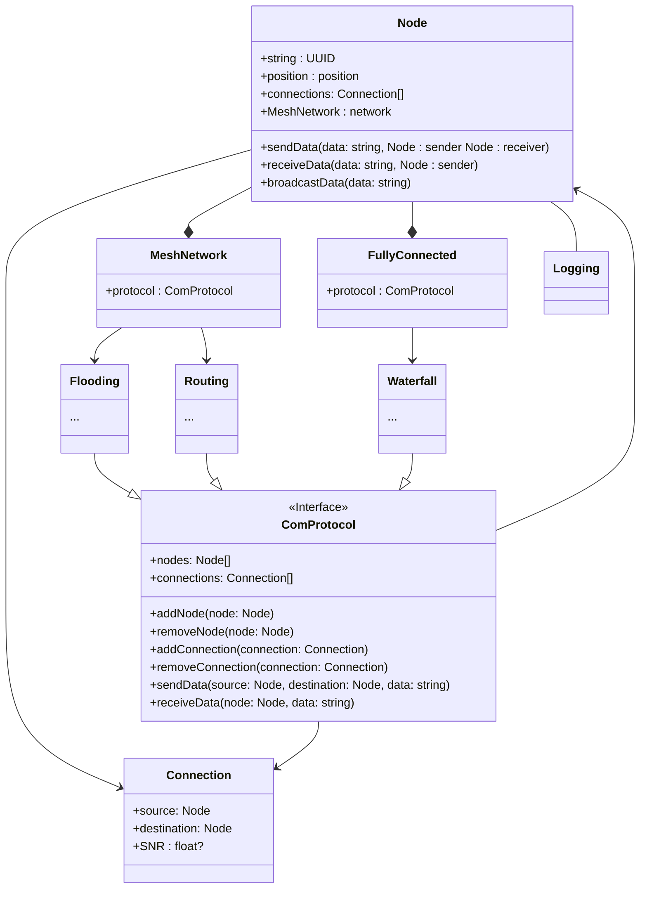

Radio Mesh Network
the focus would be on the network protocol
### Prerequisites for the design
The design choices of the initial idea of the software is as follows:
- Have each node a logfile to increase the debugging of each node.
- Have each node a different communication algorithm from a interface. 
    - The communication interface makes it possible to have networks that mix
      each other
    - Extendability
- Simulate different scenarios with different files
  - nodes not reaching each other
  - Only two nodes readches each other, the rest are out of range from any one
  - Two clusters seperated from each other.

> 12 Sep 2024

The idea of the MOC is `Node`s send, receieve and broadcasts data should be
dependant on the transmission and netowrk protocol used in the network.

The network is dependant on the communication protocol which implements how the
nodes talk together and exchange data. The network also takes care of which
nodes are currently present and which nodes can see which nodes.

Communication Protocol as the main idea of the project as it carries the
emphasis of the project. This is where how the communication should be carried
out. There is a "general" way of sending data which is why we have the interface
of the protocol

MeshNetowrk can either use the Flooding or the routing communication algorithm.
